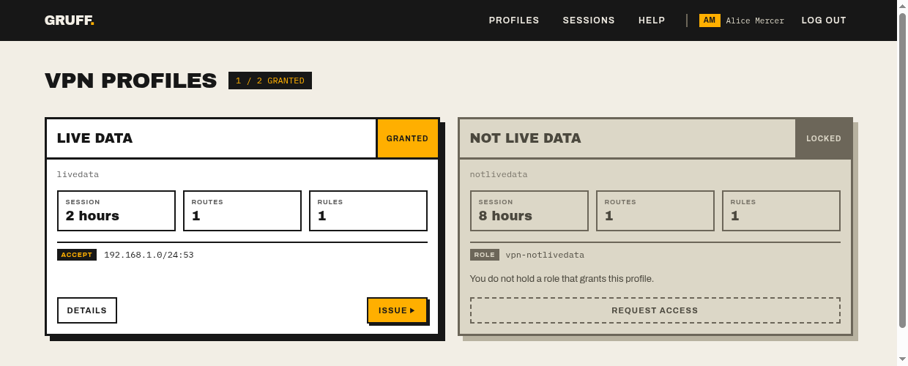

# Gruff

Short-lived access credentials, handed out behind single sign-on.

Gruff is a certificate authority with a web front end. Users sign in, pick what they
need, and get a credential that expires on its own — an OpenVPN profile, or an SSH
certificate. Nothing long-lived is enrolled, so nothing has to be revoked.



## What it does

**OpenVPN profiles.** A `.ovpn` with the client certificate, key and CA inline, valid
for the profile's `max-session`. Gruff also writes the server side: per-profile
`client-config-dir` route pushes and the iptables rules to open on connect.

**SSH certificates.** A shell script that installs a key, a certificate and an
`ssh_config` entry under `~/.ssh`, then gets out of the way — `ssh` just works until
the certificate expires. Certificates carry `user@profile` as their key ID, so sshd
logs the person rather than an anonymous key:

```
Accepted certificate ID "alice.mercer@bastion" (serial 1385015093048419262)
  signed by ED25519 CA SHA256:36vJegdN+FJ4q5b3Z/Q96rMZLm95HY917aVNPxAoDBE
```

**Server configuration.** `/setup` shows exactly what your hosts need in order to
trust Gruff — `TrustedUserCAKeys`, `AuthorizedPrincipalsFile`, the OpenVPN server
directives — so a deployment outside the bundled chart has everything it needs. It
publishes public material only.

## Security model

Read this before deploying it.

Gruff runs OpenID Connect itself (`auth.mode: oidc`), holds the session in an
encrypted cookie, and **is meant to be exposed**. Sessions are stateless: they
survive a restart or a second replica with no shared database, and rotating the
session key signs everyone out at once.

It can instead sit behind your own SSO proxy (`auth.mode: proxy`, the default). In
that mode Gruff **authenticates nobody** — it trusts `X-Auth-*` headers, so anything
that can reach it can assert its own username and roles. It binds `127.0.0.1` for
that reason and must not be put on a routable address.

Beyond that:

- **Access is denied by default.** A profile is reachable only by a user holding one
  of the roles it names; a profile naming no roles is rejected at startup.
- **VPN and SSH grants are independent.** Holding a network does not imply login on
  its hosts.
- **No key retention.** An issued private key exists for the life of the response
  carrying it. The session list records metadata only.
- **A CA is required.** Gruff will not start without one. `-dev-generate-ca` exists
  for local work and warns loudly; it mints a new trust anchor every run,
  invalidating everything issued before.

## Requirements

- an OpenID Connect provider, or a reverse proxy that sets the `X-Auth-*` headers
- a CA keypair for VPN certificates, an SSH CA key for SSH profiles
- an OpenVPN server reading the generated `client-config-dir`, if you use VPN profiles

## Build and run

```sh
make check      # go vet, gofmt, go test -race
make build      # -> ./gruff
make ui         # recompile the stylesheet after editing templates
```

Locally, with nothing provisioned:

```sh
mkdir -p tmp/tls
./gruff --config configs/conf.yaml --dev-generate-ca --dev-ca-dir tmp/tls
```

Flags: `--config`, `--log-level`, `--version`, `-dev-generate-ca`, `-dev-ca-dir`.

The binary is self-contained — templates, stylesheet and fonts are embedded, so it
runs from anywhere and serves no external origin. That is what lets the content
security policy stay at `default-src 'none'`.

## Configuration

See [`configs/conf.yaml`](configs/conf.yaml). Networks are written as CIDR
throughout, for routes and firewall rules alike:

```yaml
profiles:
  - name: livedata
    max-session: 2h
    roles: [vpn-livedata]
    routes:
      - 192.168.1.0/24
    rules:
      - dest: 192.168.1.0/24
        port: 53
        protocol: tcp
        action: ACCEPT

ssh-profiles:
  - name: bastion
    max-session: 8h
    roles: [ssh-bastion]
    principals: [deploy]
    hosts: [bastion.example.com]
```

Configuration is validated once at startup: a bad duration, a non-CIDR network, an
unknown firewall action or a profile granting no roles fails the process rather than
a request.

## Deployment

The [Helm chart](deployment/helm/gruff) runs Gruff and OpenVPN in one pod, with the
Ingress targeting Gruff directly. It requires `ca.existingSecret`,
`openvpn.existingSecret` and `auth.existingSecret`, and fails to render without them.

The container is built `FROM scratch`: no shell, no libc, no CA bundle — nothing to
execute if the process is ever subverted.

Kubernetes is the worked example, not a requirement. Gruff is a single static binary
and a config file; `/setup` covers the rest.
